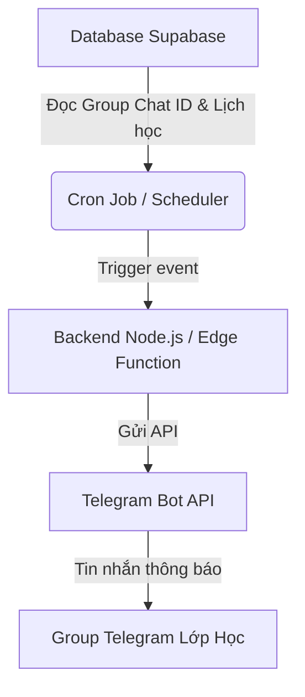

# Đặc tả và Kế hoạch triển khai Telegram Chatbot Nhắc Lịch Học

Tài liệu này tổng hợp yêu cầu, phân tích kỹ thuật và kế hoạch chi tiết (planning) để xây dựng hệ thống Telegram Chatbot tự động nhắc lịch học, lịch Office Hour và các hoạt động khác dựa trên dữ liệu lịch trình của khóa học **The1ight** trực tiếp lên **Group Telegram chung**.

---

## 1. Yêu Cầu Chức Năng (Requirements)

### 1.1. Gửi thông báo nhắc lịch tự động lên Group chung
*   **Không gửi qua tài khoản cá nhân:** Bot sẽ được thêm vào Group Telegram chung của khóa học để nhắc lịch cho tất cả thành viên thay vì liên kết với từng tài khoản học viên.
*   **Thời điểm gửi thông báo (2 lần):**
    *   **Lần 1 (Trước 1 ngày):** Gửi vào lúc **9h00 sáng ngày hôm trước** khi sự kiện diễn ra.
    *   **Lần 2 (Trước 1 tiếng):** Gửi vào trước **1 tiếng** khi sự kiện chính thức bắt đầu.
*   **Nội dung thông báo:**
    *   Tiêu đề buổi học, thời gian chính xác.
    *   Đường link tham gia (Zoom/Google Meet) và các lưu ý chuẩn bị bài tập (được lấy template tương tự [Email Template](file:///Users/danghong/Documents/The1ight/LightMS/C_Input_Research/%5BGGCalendar%20+%20FB%20Events%5D%20Email%20Template.md)).

### 1.2. Đối với Ban Quản trị (Admins / Trainers)
*   **Quản lý cấu hình lịch học:** Admin có thể bật/tắt nhắc lịch, chỉnh sửa khung giờ học hoặc thêm các ngày nghỉ (ví dụ: Tuần nghỉ sản phẩm từ 27/08 - 04/09) để Bot không gửi nhắc nhở sai lệch.

---

## 2. Phân Tích Lịch Trình & Quy Luật Nhắc Nhở (Mới)

Dựa trên cấu trúc lịch học của khóa học, Bot sẽ gửi tin nhắn vào Group Telegram chung theo các mốc thời gian sau:

| Sự kiện | Khung giờ diễn ra | Gửi Lần 1 (9h00 sáng ngày hôm trước) | Gửi Lần 2 (Trước 1 tiếng) |
| :--- | :--- | :--- | :--- |
| **Kick-off Meeting** | 14h30 Thứ 7 (18/07) | 09h00 Thứ 6 (17/07) | 13h30 Thứ 7 (18/07) |
| **Onboarding Week** | **5h00 sáng hàng ngày (20/07 - 26/07)** | *Không áp dụng* | **Gửi lúc 5h00 sáng hàng ngày** |
| **Live Class Tối** | 20h30 Thứ 4 | **09h00 Thứ 3** | **19h30 Thứ 4** |
| **Live Class Chiều** | 14h30 Thứ 7 | **09h00 Thứ 6** | **13h30 Thứ 7** |
| **Office Hour** | 15h30 Chủ Nhật | **09h00 Thứ 7** | **14h30 Chủ Nhật** |

---

## 3. Kiến Trúc Hệ Thống & Giải Pháp Kỹ Thuật

Sử dụng mô hình kiến trúc tích hợp trực tiếp vào hệ thống **LightMS** hiện tại:

### 3.1. Cấu hình Telegram Bot Info
*   **Bot Username:** `@lightms_bot` (t.me/lightms_bot)
*   **Bot Token:** `855857259:AAH1BOP949HBHJjEVzdyFXpTJwTnBzubRj8` (Đã khởi tạo qua `@BotFather`)
*   **Group Chat ID:** Sẽ cấu hình cứng `TELEGRAM_GROUP_CHAT_ID` trong biến môi trường `.env` sau khi thêm Bot vào Group và lấy Chat ID của Group.

### 3.2. Công nghệ đề xuất
*   **Lập lịch gửi tin nhắn (Scheduler):**
    *   Sử dụng **pg_cron** trong Supabase để trigger một **Edge Function** quét lịch học mỗi giờ, hoặc chạy script Node.js với `node-schedule` trên server để quét lịch và lập lịch gửi chính xác.

### 3.3. Ràng buộc & Giải pháp vận hành (Constraints & Cloud Deployment)
Để bot hoạt động tự động 24/7 mà **không phụ thuộc vào việc máy tính cá nhân (máy của bạn hoặc sếp) có bật hay không**, hệ thống nhắc lịch cần tuân thủ các ràng buộc và phương án triển khai sau:

> [!IMPORTANT]
> **Ràng buộc hạ tầng (Constraints):**
> *   **Local Development:** Khi đang code ở dưới máy cá nhân (local), script lập lịch nhắc học chỉ chạy khi terminal và máy tính của lập trình viên đang mở.
> *   **Production Deployment:** Khi release sản phẩm, toàn bộ mã nguồn của Telegram Bot và Scheduler bắt buộc phải được đẩy lên môi trường **Cloud** (Server luôn mở 24/7).

**Các giải pháp triển khai Cloud đề xuất:**
1.  **Phương án 1 (Serverless hoàn toàn - Khuyên dùng):**
    *   Deploy code trigger tin nhắn lên **Supabase Edge Functions** (Chạy trên cloud của Supabase).
    *   Dùng **Supabase pg_cron** hoặc các service scheduler miễn phí như **Upstash Workflow / Cron** để trigger Edge Function đó gửi tin nhắn vào đúng khung giờ chỉ định.
    *   *Ưu điểm:* Hoàn toàn miễn phí ở quy mô hiện tại, không cần thuê server riêng, tự động chạy 24/7 không cần bật máy.
2.  **Phương án 2 (Độc lập/VPS Server):**
    *   Đẩy file script chạy Node.js lên các Cloud platform như **Render**, **Railway** hoặc VPS cá nhân và dùng công cụ quản lý process như `pm2` để đảm bảo bot luôn sống.
    *   *Ưu điểm:* Dễ kiểm soát log, dễ debug trực tiếp bằng code Node.js quen thuộc.

### 3.4. Phân Tích Quyết Định Kiến Trúc (Architecture Decision Resolution - DAR)

Báo cáo phân tích và so sánh 3 phương án: **Supabase pg_cron**, **Google Apps Script (GAS)** (sử dụng lịch Google Calendar hoặc Google Sheets làm nguồn trigger và gọi Telegram API), và **Node.js Server (Render/VPS)**.

#### A. Các tiêu chí đánh giá (Evaluation Criteria)
1.  **Chi phí (Cost):** Tối ưu tài chính, ưu tiên 100% miễn phí (Free Tier) hoặc chi phí cực thấp ở quy mô lớp học.
2.  **Rủi ro lỗi thấp (Reliability & Low Error Risk):** Khả năng chạy ổn định, không bị ngắt quãng, tự động phục hồi nếu có lỗi mạng, dễ kiểm soát và không bị lệch múi giờ.
3.  **Dễ thiết lập (Ease of Setup & Development):** Tốc độ coding, tích hợp trực tiếp với database/API hiện tại của LightMS mà không cần viết thêm quá nhiều cầu nối trung gian (bridge).

#### B. Bảng so sánh chi tiết (Comparison Matrix)

| Tiêu chí | Supabase pg_cron + Edge Function | Google Apps Script (GAS) | Node.js Server (Render/VPS) |
| :--- | :--- | :--- | :--- |
| **Chi phí** | 🟢 **100% Free** (Nằm trong gói miễn phí của Supabase) | 🟢 **100% Free** (Gắn liền với tài khoản Google Workspace/Gmail) | 🟡 **Có thể tốn phí** (Render Free-tier sẽ bị ngủ sau 15p idle; VPS tốn ~3-5$/tháng) |
| **Rủi ro lỗi** | 🟢 **Thấp nhất** (Chạy trực tiếp trên cloud Supabase, kết nối DB nội bộ an toàn và đồng bộ múi giờ tốt) | 🟡 **Trung bình** (Có giới hạn quota gọi API của Google, dễ lỗi nếu link meeting thay đổi đột ngột ngoài Calendar) | 🟢 **Thấp** (Nếu dùng VPS riêng; nếu dùng Render Free sẽ có độ trễ khởi động) |
| **Dễ thiết lập** | 🟡 **Trung bình** (Cần biết viết SQL pg_cron hoặc deploy Edge Function qua CLI) | 🟢 **Dễ nhất** (Viết trực tiếp code JavaScript trên giao diện Web của Google, setup trigger bằng vài cú click chuột) | 🔴 **Phức tạp nhất** (Cần setup môi trường deploy, cài thư viện, quản lý tiến trình chạy nền) |
| **Khả năng tích hợp dữ liệu** | 🟢 **Rất tốt** (Truy vấn thẳng DB lớp học của LightMS để lấy dữ liệu real-time) | 🔴 **Kém** (Phải sync dữ liệu lịch học ra Google Calendar/Sheets trước rồi GAS mới đọc được) | 🟢 **Tốt** (Giao tiếp API hoặc kết nối DB trực tiếp) |

#### D. Đề xuất lựa chọn (Recommendation)
*   👉 **Lựa chọn tối ưu nhất (Thống nhất phương án):** **Google Apps Script (GAS) đọc trực tiếp từ Google Calendar**
    *   *Lý do:* Vì lịch học của khóa học gần như đã cố định (fix), phương án này là tối ưu nhất. Nó hoạt động độc lập, chạy 100% miễn phí trên hạ tầng Cloud của Google 24/7 mà không cần bật máy tính cá nhân, không cần mua tên miền riêng và cực kỳ dễ bảo trì. Nếu có sự thay đổi lịch học đột xuất, admin chỉ cần điều chỉnh trực tiếp trên Google Calendar (ví dụ qua điện thoại).

---

## 4. Kế Hoạch Triển Khai bằng Google Apps Script (Implementation Plan)

### Chặng 1: Thiết lập và Cấu hình (Ngày 1)
- [ ] Thêm Telegram Bot `@lightms_bot` (Token: `855857259:AAH1BOP949HBHJjEVzdyFXpTJwTnBzubRj8`) vào Group Telegram chung của khóa học và lấy `TELEGRAM_GROUP_CHAT_ID`.
- [ ] Chuẩn bị cuốn lịch Google Calendar chứa lịch học của khóa học và lấy **Calendar ID** (Ví dụ: `xxxx@group.calendar.google.com`).

### Chặng 2: Phát triển Script trên Google Apps Script (Ngày 2)
- [ ] Tạo dự án Apps Script mới trên Google Drive.
- [ ] Viết hàm `sendTelegramMessage(message)` sử dụng dịch vụ `UrlFetchApp` để bắn API tin nhắn đến Group Telegram.
- [ ] Viết hàm `checkAndNotifyCalendarEvents()`:
    *   Sử dụng API `CalendarApp` để lấy các sự kiện của ngày mai (để gửi nhắc nhở lúc 9h00 sáng hôm trước) và các sự kiện bắt đầu sau 1 tiếng nữa.
    *   Tự động định dạng tin nhắn theo đúng mẫu template thiết kế tại [Email Template](file:///Users/danghong/Documents/The1ight/LightMS/C_Input_Research/%5BGGCalendar%20+%20FB%20Events%5D%20Email%20Template.md) (bao gồm link Zoom học, tiêu đề, và ghi chú chuẩn bị bài tập).

### Chặng 3: Thiết lập Trigger Lập lịch (Ngày 3)
- [ ] Cấu hình **Trigger 1 (Time-driven)**: Chạy hàm kiểm tra lịch vào lúc **9h00 sáng hàng ngày** để nhắc lịch cho ngày mai.
- [ ] Cấu hình **Trigger 2 (Time-driven)**: Chạy hàm kiểm tra lịch **mỗi 10 phút hoặc 15 phút** một lần để quét và gửi tin nhắn trước giờ học 1 tiếng.
- [ ] Riêng với tuần **Onboarding Week**, cấu hình chạy gửi thử thách vào đúng **5h00 sáng hàng ngày** trong thời gian từ 20/07 - 26/07.

### Chặng 4: Kiểm thử và Vận hành (Ngày 4)
- [ ] Thử nghiệm thay đổi sự kiện trực tiếp trên Google Calendar để kiểm tra tính năng tự động cập nhật của Bot.
- [ ] Giám sát lịch sử chạy (Execution logs) trên trang quản trị Google Apps Script để đảm bảo không bị miss sự kiện.
