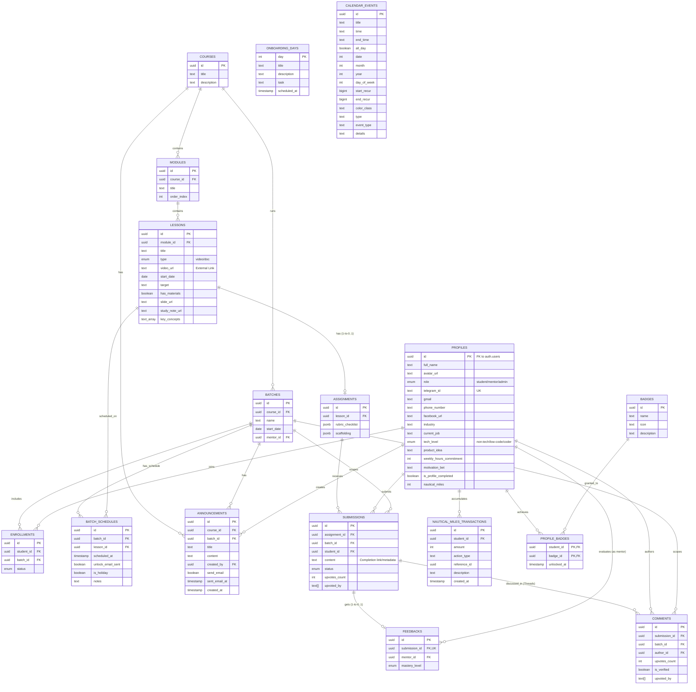

# The1ight LMS - B3: Entity Relationship Diagram (ERD)

Dưới đây là sơ đồ thực thể liên kết (ERD) trực quan hóa cấu trúc dữ liệu của The1ight LMS. Sơ đồ này thể hiện rõ mối quan hệ giữa hệ thống Khóa học, Học viên, và Tiến trình học tập (Outcome-based).

## Chú giải (Legend):
- `||--o{` : Quan hệ 1 - Nhiều (One-to-Many). Ví dụ: 1 Khóa học có nhiều Modules.
- `||--o|` : Quan hệ 1 - 1 (hoặc không có). Ví dụ: 1 Bài nộp (Submission) chỉ có 1 Feedback.
- `PK` : Primary Key (Khóa chính).
- `FK` : Foreign Key (Khóa ngoại).
- `UK` : Unique Key (Khóa duy nhất).
