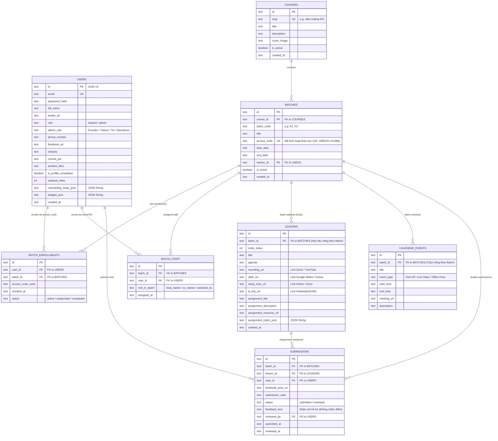

# The1ight LMS - B3: Entity Relationship Diagram (ERD)

> **Last Updated:** 2026-10-01 | **Status:** ✅ Synced với Cloudflare D1 SQLite & Drizzle ORM Schema (Multi-Course & Access Code)

Dưới đây là sơ đồ thực thể liên kết (ERD) trực quan hóa cấu trúc dữ liệu trên **Cloudflare D1**. Sơ đồ thể hiện rõ mối quan hệ giữa Hệ sinh thái Khóa học, Các lớp học (Batches), Mã kích hoạt ghi danh (Access Codes), Bài học, và Bài nộp của học viên.

```mermaid
erDiagram
    USERS {
        text id PK "UUID v4"
        text email UK
        text password_hash
        text full_name
        text avatar_url
        text role "student / admin"
        text admin_role "Founder / Trainer / TA / Operations"
        text phone_number
        text facebook_url
        text industry
        text current_job
        text product_idea
        boolean is_profile_completed
        int nautical_miles
        text onboarding_tasks_json "JSON String"
        text badges_json "JSON String"
        text created_at
    }

    COURSES {
        text id PK
        text slug UK "e.g. vibe-coding-201"
        text title
        text description
        text cover_image
        boolean is_active
        text created_at
    }

    BATCHES {
        text id PK
        text course_id FK "FK to COURSES"
        text batch_code "e.g. K1, K2"
        text title
        text access_code UK "Mã kích hoạt khóa học (VD: VIBE201-K3-888)"
        text start_date
        text end_date
        text mentor_id FK "FK to USERS"
        boolean is_active
        text created_at
    }

    BATCH_ENROLLMENTS {
        text id PK
        text user_id FK "FK to USERS"
        text batch_id FK "FK to BATCHES"
        text access_code_used
        text enrolled_at
        text status "active / suspended / completed"
    }

    BATCH_STAFF {
        text id PK
        text batch_id FK "FK to BATCHES"
        text user_id FK "FK to USERS"
        text role_in_batch "lead_trainer / co_trainer / assistant_ta"
        text assigned_at
    }

    LESSONS {
        text id PK
        text batch_id FK "FK to BATCHES (Học liệu riêng theo Batch)"
        int order_index
        text title
        text agenda
        text recording_url "Link Zoom / YouTube"
        text slide_url "Link Google Slides / Canva"
        text study_note_url "Link Notion / Docs"
        text ai_bot_url "Link NotebookLM Bot"
        text assignment_title
        text assignment_description
        text assignment_resource_url
        text assignment_rubric_json "JSON String"
        text created_at
    }

    CALENDAR_EVENTS {
        text id PK
        text batch_id FK "FK to BATCHES (Tách riêng theo Batch)"
        text title
        text event_type "Kick-off / Live Class / Office Hour"
        text start_time
        text end_time
        text meeting_url
        text description
    }

    SUBMISSIONS {
        text id PK
        text batch_id FK "FK to BATCHES"
        text lesson_id FK "FK to LESSONS"
        text user_id FK "FK to USERS"
        text facebook_post_url
        text submission_note
        text status "submitted / reviewed"
        text feedback_text "Nhận xét hỗ trợ (không chấm điểm)"
        text reviewed_by FK "FK to USERS"
        text submitted_at
        text reviewed_at
    }


    COURSES ||--o{ BATCHES : "contains"
    BATCHES ||--o{ BATCH_ENROLLMENTS : "has enrollments"
    USERS ||--o{ BATCH_ENROLLMENTS : "enrolls via access_code"
    BATCHES ||--o{ BATCH_STAFF : "assigned staff"
    USERS ||--o{ BATCH_STAFF : "serves as trainer/TA"
    BATCHES ||--o{ LESSONS : "batch syllabus & links"
    BATCHES ||--o{ CALENDAR_EVENTS : "batch schedule"
    BATCHES ||--o{ SUBMISSIONS : "student submissions"
    LESSONS ||--o{ SUBMISSIONS : "assignment responses"
    USERS ||--o{ SUBMISSIONS : "submits work"
```

---

## Mối quan hệ chính:

1. **COURSES 1 - N BATCHES:** Một Khóa học (ví dụ: Vibe Coding 201) có thể mở nhiều Lớp (Batch K1, K2, K3...).
2. **BATCHES 1 - N BATCH_ENROLLMENTS N - 1 USERS:** Học viên ghi danh vào từng Batch thông qua **`access_code`**.
3. **BATCHES 1 - N BATCH_STAFF N - 1 USERS:** Phân công Giảng viên (Trainer) và Trợ giảng (TA) phụ trách cụ thể cho từng Batch.
4. **BATCHES 1 - N LESSONS:** Mỗi Batch sở hữu danh sách bài học và tài nguyên links riêng biệt (hỗ trợ 1-click clone từ Batch trước khi mở lớp mới).
5. **BATCHES 1 - N (CALENDAR_EVENTS / SUBMISSIONS):** Lịch học và Bài nộp được tách biệt hoàn toàn theo từng Batch để đảm bảo tính riêng tư và đúng ngữ cảnh cho từng lớp.

